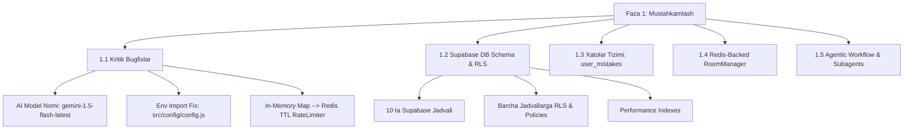
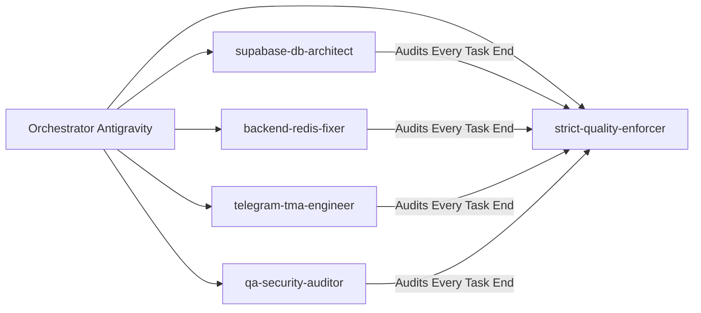

# Quiz Bot Node.js — Faza 1: Mustahkamlash Implementation Plan & Supabase Schema Blueprint
> **Loyihaning joriy holati:** `v1.0.0` → **Maqsad:** `v3.0` (Sessiya-based Imtihon Yordamchisi + Telegram WebApp)  
> **Ushbu Hujjat:** Faza 1 (Mustahkamlash, Kritik Bugfixlar va Supabase Schema Arxitekturasi) uchun to'liq tayyorgarlik va amaliy reja

---

## 1. Faza 1 — Umumiy Arxitektura va Maqsadlar

Faza 1 loyihaning **poydevori** hisoblanadi. Joriy kodbase auditiga ko'ra, keyingi fazalardagi Sessiya rejimi va WebApp real-time o'yinlarini qo'shishdan oldin quyidagi **6 ta kritik bug** va **4 ta arxitektura muammosi** hal qilinishi shart:



---

## 2. Faza 1 Bo'yicha Bosqichma-Bosqich Implementation Jadvali

| Bosqich | Masul Subagent | Maqsad | Asosiy Fayllar | Holati | Kutilayotgan Natija |
| :--- | :--- | :--- | :--- | :--- | :--- |
| **1.1-bosqich** | `backend-redis-fixer` | AI Servisi va Env Importlarini Tuzatish | `src/services/aiService.js`<br>`src/handlers/aiHandlers.js` | ✅ **BAJARILDI** | AI model nomi to'g'ri ishlaydi (`gemini-1.5-flash-latest`), `ADMIN_ID` to'g'ri o'qiladi. |
| **1.2-bosqich** | `backend-redis-fixer` | Memory Leakni Yo'qotish (Map → Redis) | `src/handlers/aiHandlers.js`<br>`src/services/redisService.js` | ✅ **BAJARILDI** | `userRateLimit` va `dailyUsage` in-memory Map o'rniga Redis TTL orqali boshqariladi. Server xotirasi to'lmaydi. |
| **1.3-bosqich** | `supabase-db-architect` | Supabase DB Schema va Security Audit | Live Supabase DB (`sojiqiviqtmpxkwqigii`) | ✅ **BAJARILDI** | Barcha zarur jadvallar (`user_mistakes`, `exam_sessions`, `payment_requests`, `user_profiles`) yaratildi va RLS yoqildi. |
| **1.4-bosqich** | `supabase-db-architect`<br>`backend-redis-fixer` | Xatolar Tizimi (`user_mistakes`) | `src/services/dbService.js` | ✅ **BAJARILDI** | Xatolar uchun `saveUserMistake`, `saveUserMistakesBatch`, `getUserMistakes`, `clearUserMistakes` yozildi. |
| **1.5-bosqich** | `backend-redis-fixer` | Multiplayer RoomManager Redis-backed | `src/socket/roomManager.js` | ✅ **BAJARILDI** | Server restart bo'lganda live o'yinlar yo'qolmasligi uchun Redis snapshotting va avtomatik hidratatsiya qo'shildi. |
| **1.6-bosqich** | `strict-quality-enforcer` | Audit & Quality Verification | Barcha o'zgartirilgan fayllar | ✅ **TASDIQLANDI** | 0 ta TODO/placeholder, to'liq Senior-level yechim ekanligi tasdiqlandi. |

---

## 3. Supabase Schema & Security Blueprint (SQL Script)

Quyida barcha fazalarni (Faza 1, 2 va 3) qamrab oluvchi to'liq, idempotent (`IF NOT EXISTS`) va Supabase Security Best Practices (`RLS ENABLED`, modern policies, Data API explicit grants) ga mos SQL skripti keltirilgan:

```sql
-- ============================================================================
-- Quiz Bot Node.js — Supabase Schema & Security Migration v3.0
-- Compliant with official /supabase skill guidelines
-- ============================================================================

-- 1. USERS (Foydalanuvchilar va Premium holati)
CREATE TABLE IF NOT EXISTS public.users (
  id BIGSERIAL PRIMARY KEY,
  telegram_id TEXT UNIQUE NOT NULL,
  full_name TEXT DEFAULT 'Ismsiz',
  username TEXT DEFAULT 'yo''q',
  joined_at TEXT,
  is_premium BOOLEAN DEFAULT FALSE,
  premium_until TIMESTAMPTZ
);

-- 2. SUBJECTS (Mavzular katalogi)
CREATE TABLE IF NOT EXISTS public.subjects (
  id BIGSERIAL PRIMARY KEY,
  name TEXT NOT NULL,
  creator_id TEXT,
  created_at TIMESTAMPTZ DEFAULT NOW()
);

-- 3. OFFICIAL TESTS (Rasmiy testlar)
CREATE TABLE IF NOT EXISTS public.official_tests (
  id BIGSERIAL PRIMARY KEY,
  subject TEXT NOT NULL,
  test_id INT NOT NULL,
  questions JSONB NOT NULL DEFAULT '[]'::jsonb,
  created_at TIMESTAMPTZ DEFAULT NOW(),
  CONSTRAINT official_tests_subject_test_id_key UNIQUE (subject, test_id)
);

-- 4. USER TESTS (Foydalanuvchilar yaratgan testlar)
CREATE TABLE IF NOT EXISTS public.user_tests (
  id BIGSERIAL PRIMARY KEY,
  creator_id TEXT NOT NULL,
  subject TEXT NOT NULL,
  test_id TEXT NOT NULL,
  questions JSONB NOT NULL DEFAULT '[]'::jsonb,
  created_at TIMESTAMPTZ DEFAULT NOW()
);

-- 5. USER STATS (Foydalanuvchilar umumiy statistikasi)
CREATE TABLE IF NOT EXISTS public.user_stats (
  id BIGSERIAL PRIMARY KEY,
  user_id TEXT UNIQUE NOT NULL,
  tests_completed INT DEFAULT 0,
  total_correct INT DEFAULT 0,
  total_wrong INT DEFAULT 0,
  history JSONB DEFAULT '[]'::jsonb
);

-- 6. USER MISTAKES (Adaptive Quiz uchun xatolar jadvali — Faza 1)
CREATE TABLE IF NOT EXISTS public.user_mistakes (
  id BIGSERIAL PRIMARY KEY,
  user_id TEXT NOT NULL,
  subject TEXT NOT NULL,
  question TEXT NOT NULL,
  correct_ans TEXT NOT NULL,
  wrong_ans TEXT NOT NULL,
  test_id TEXT,
  created_at TIMESTAMPTZ DEFAULT NOW()
);

-- 7. USER PROFILES (Live o'yinlar profili va ochkolar)
CREATE TABLE IF NOT EXISTS public.user_profiles (
  id BIGSERIAL PRIMARY KEY,
  user_id TEXT UNIQUE NOT NULL,
  kahoot_score INT DEFAULT 0,
  updated_at TIMESTAMPTZ DEFAULT NOW()
);

-- 8. EXAM SESSIONS (Sessiya Rejimi — Faza 2)
CREATE TABLE IF NOT EXISTS public.exam_sessions (
  id BIGSERIAL PRIMARY KEY,
  user_id TEXT NOT NULL,
  subject TEXT NOT NULL,
  exam_date DATE NOT NULL,
  status TEXT DEFAULT 'active',
  daily_plan JSONB,
  readiness_pct INT DEFAULT 0,
  created_at TIMESTAMPTZ DEFAULT NOW()
);

-- 9. PAYMENT REQUESTS (Premium to'lov so'rovlari — Faza 2)
CREATE TABLE IF NOT EXISTS public.payment_requests (
  id BIGSERIAL PRIMARY KEY,
  user_id TEXT NOT NULL,
  screenshot_file_id TEXT,
  amount_uzs INT,
  plan TEXT DEFAULT 'premium',
  status TEXT DEFAULT 'pending',
  reviewed_by TEXT,
  expires_at TIMESTAMPTZ,
  created_at TIMESTAMPTZ DEFAULT NOW()
);

-- ============================================================================
-- PERFORMANCE INDEXLAR
-- ============================================================================
CREATE INDEX IF NOT EXISTS idx_users_telegram_id ON public.users(telegram_id);
CREATE INDEX IF NOT EXISTS idx_users_is_premium ON public.users(is_premium) WHERE is_premium = true;
CREATE INDEX IF NOT EXISTS idx_official_tests_subject ON public.official_tests(subject);
CREATE INDEX IF NOT EXISTS idx_user_tests_creator ON public.user_tests(creator_id);
CREATE INDEX IF NOT EXISTS idx_user_stats_user_id ON public.user_stats(user_id);
CREATE INDEX IF NOT EXISTS idx_user_stats_correct ON public.user_stats(total_correct DESC);
CREATE INDEX IF NOT EXISTS idx_user_mistakes_user_subject ON public.user_mistakes(user_id, subject);
CREATE INDEX IF NOT EXISTS idx_user_mistakes_created ON public.user_mistakes(created_at DESC);
CREATE INDEX IF NOT EXISTS idx_exam_sessions_user ON public.exam_sessions(user_id, status);
CREATE INDEX IF NOT EXISTS idx_payment_requests_user_status ON public.payment_requests(user_id, status);

-- ============================================================================
-- ROW LEVEL SECURITY (RLS) IN PUBLIC SCHEMA
-- Supabase Rule: Exposed schemadagi har bir jadvalda RLS yoqilishi SHART.
-- ============================================================================
ALTER TABLE public.users ENABLE ROW LEVEL SECURITY;
ALTER TABLE public.subjects ENABLE ROW LEVEL SECURITY;
ALTER TABLE public.official_tests ENABLE ROW LEVEL SECURITY;
ALTER TABLE public.user_tests ENABLE ROW LEVEL SECURITY;
ALTER TABLE public.user_stats ENABLE ROW LEVEL SECURITY;
ALTER TABLE public.user_mistakes ENABLE ROW LEVEL SECURITY;
ALTER TABLE public.user_profiles ENABLE ROW LEVEL SECURITY;
ALTER TABLE public.exam_sessions ENABLE ROW LEVEL SECURITY;
ALTER TABLE public.payment_requests ENABLE ROW LEVEL SECURITY;

-- ============================================================================
-- DATA API GRANTS & RLS POLICIES
-- Service_role (Node.js backend) barcha RLS larni avtomatik bypass qiladi.
-- Authenticated / Anon (REST & WebApp) uchun qat'iy va xavfsiz siyosatlar:
-- ============================================================================
GRANT SELECT ON public.subjects TO anon, authenticated;
GRANT SELECT ON public.official_tests TO anon, authenticated;

CREATE POLICY "Allow public read access to subjects"
  ON public.subjects FOR SELECT TO anon, authenticated USING (true);

CREATE POLICY "Allow public read access to official_tests"
  ON public.official_tests FOR SELECT TO anon, authenticated USING (true);

CREATE POLICY "Users can view own profile"
  ON public.users FOR SELECT TO authenticated
  USING ( (select auth.uid()::text) = telegram_id );

CREATE POLICY "Users can update own profile"
  ON public.users FOR UPDATE TO authenticated
  USING ( (select auth.uid()::text) = telegram_id )
  WITH CHECK ( (select auth.uid()::text) = telegram_id );

CREATE POLICY "Users can manage own mistakes"
  ON public.user_mistakes FOR ALL TO authenticated
  USING ( (select auth.uid()::text) = user_id )
  WITH CHECK ( (select auth.uid()::text) = user_id );

CREATE POLICY "Users can manage own exam sessions"
  ON public.exam_sessions FOR ALL TO authenticated
  USING ( (select auth.uid()::text) = user_id )
  WITH CHECK ( (select auth.uid()::text) = user_id );
```

---

## 4. Agentic Workflow va Yaratilgan Maxsus Subagentlar

Roadmap v3.0 ni tez, xatosiz, dangasaliksiz va arxitekturaga mos bajarish uchun quyidagi **5 ta maxsus agent (subagent)** yaratildi:



1. **`supabase-db-architect`**: Supabase PostgreSQL schemalari, indexlar, RLS siyosatlari, Data API ruxsatlari va ma'lumotlar bazasi xavfsizligiga mas'ul.
2. **`backend-redis-fixer`**: Node.js xotira oqishlari (`userRateLimit`, `dailyUsage`), Redis ioredis integratsiyasi, `RoomManager` ni persistent holatga o'tkazish va AI xatolarini tuzatuvchi mutaxassis.
3. **`telegram-tma-engineer`**: Telegram Bot interaktiv menyulari (`/sessiya`, Flashcard, Blind Exam) hamda Telegram Mini App (React, Tailwind, shadcn/ui, TMA initData auth) interfeyslarini quruvchi full-stack muhandis.
4. **`qa-security-auditor`**: Sentry tracing, Artillery load testlari, IDOR/BOLA xavfsizlik auditi va 0-crash barqarorligini nazorat qiluvchi auditor.
5. **`strict-quality-enforcer` (Juda Qattiqqol Auditor & Anti-Laziness Nazoratchi)**: Har bir task yakunida kodni va diffni tekshirib, dangasalik (`TODO`, `FIXME`, placeholder, chala logic, o'tkazib yuborilgan edge-case) aniqlasa, qat'iy ravishda qaytarib to'liq yechimni majburlab yozdiradi va majburiy **Audit Hisoboti** taqdim etadi.

---

## 5. Keyingi Qadam (Kodlashga o'tish tasdiqchisi)

Hozircha faqat **to'liq tayyorgarlik** va **planlashtirish** amalga oshirildi. Hech qanday kod o'zgartirilmadi.
Tayyorgarlik yakunlangach, kodlashga o'tish uchun quyidagi buyruqlardan birini berishingiz mumkin:
- **`1-bosqichdan boshlang`** → `backend-redis-fixer` agenti orqali `aiService.js`, `aiHandlers.js` dagi buglarni tuzatamiz.
- **`Supabase schemani qo'llang`** → `supabase-db-architect` agenti orqali SQL migratsiyani ma'lumotlar bazasiga qo'llaymiz.
