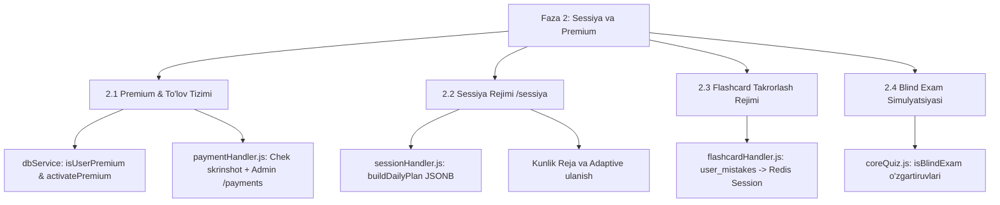

# Quiz Bot Node.js — Faza 2: Sessiya Rejimi, Premium & Monetizatsiya, Flashcard va Blind Exam Implementation Plan
> **Loyihaning joriy holati:** Faza 1 100% Yakunlandi (`v2.0.0` Barqaror poydevor) → **Maqsad:** Faza 2 (`v2.5.0` Sessiya, Premium, Flashcard, Blind Exam)

---

## 1. Faza 2 — Umumiy Arxitektura va Maqsadlar

Faza 2 loyihani oddiy quiz botdan **Shaxsiy Imtihon Yordamchisiga (Personal Exam Assistant)** aylantiradi. Faza 1 da yaratilgan Supabase jadvallari (`user_mistakes`, `exam_sessions`, `payment_requests`, `users.is_premium`) va Redis infratuzilmasidan foydalanib quyidagi 4 ta asosiy modul quriladi:

---

## 2. Tokenlarni Tejovchi (Zero-Token-Burn) Subagentlar Strategiyasi

Subagentlar har safar kodbaseni boshidan o'rganib minglab token sarflamasligi uchun, biz ularni `define_subagent` orqali **to'liq me'moriy kontekst, aniq fayl nomlari, jadval tuzilishi va eksport qilingan metodlar ro'yxati** bilan jihozlaymiz.

### Faza 2 Subagentlar Ro'yxati:
1. **`phase2-premium-payment-engineer`**:
   - **Vazifasi:** `src/services/dbService.js` da `isUserPremium` / `activatePremium` metodlari va `src/handlers/paymentHandler.js` modulini yaratish.
   - **Oldindan beriladigan kontekst:** `users(telegram_id, is_premium, premium_until)` va `payment_requests(user_id, screenshot_file_id, amount_uzs, plan, status)` jadvallari.
2. **`phase2-session-exam-specialist`**:
   - **Vazifasi:** `src/handlers/sessionHandler.js` modulini yaratish va `/sessiya` buyrug'i, kunlik tayyorgarlik rejasi (`buildDailyPlan`), hamda zaif joylardan savol berish (Adaptive) logikasini o'rnatish.
   - **Oldindan beriladigan kontekst:** `exam_sessions(user_id, subject, exam_date, status, daily_plan, readiness_pct)` jadvali va `getUserMistakes` metodi.
3. **`phase2-flashcard-blindexam-builder`**:
   - **Vazifasi:** `src/handlers/flashcardHandler.js` (Redis `flash:${userId}` orqali flashcard) va `src/handlers/coreQuiz.js` da `isBlindExam` rejimini qo'shish.
   - **Oldindan beriladigan kontekst:** `redisService` pipeline lari va `coreQuiz.js` dagi o'yin vaqt o'lchagichlari.
4. **`strict-quality-enforcer`**:
   - **Vazifasi:** Har bir bajarilgan vazifani audit qilib, 0 ta TODO/placeholder mezonini ta'minlash.

---

## 3. Bosqichma-Bosqich Implementation Jadvali

| Bosqich | Masul Subagent | Maqsad | Asosiy Fayllar | Holati |
| :--- | :--- | :--- | :--- | :--- |
| **2.1** | `phase2-premium-payment-engineer` | Premium holatni tekshirish va faollashtirish | `src/services/dbService.js` | ✅ BAJARILDI / TASDIQLANDI |
| **2.2** | `phase2-premium-payment-engineer` | To'lov va chek skrinshot axborot oqimi | `src/handlers/paymentHandler.js` `src/index.js` | ✅ BAJARILDI / TASDIQLANDI |
| **2.3** | `phase2-session-exam-specialist` | Sessiya Rejimi (`/sessiya`) va Kunlik Reja | `src/handlers/sessionHandler.js` `src/index.js` | ✅ BAJARILDI / TASDIQLANDI |
| **2.4** | `phase2-flashcard-blindexam-builder` | Flashcard (Kartochkalar) Rejimi | `src/handlers/flashcardHandler.js` `src/index.js` | ✅ BAJARILDI / TASDIQLANDI |
| **2.5** | `phase2-flashcard-blindexam-builder` | Blind Exam (Simulyatsiya) Rejimi | `src/handlers/coreQuiz.js` | ✅ BAJARILDI / TASDIQLANDI |
| **2.6** | `strict-quality-enforcer` | Senior Audit & Verification | Barcha yangi va o'zgartirilgan fayllar | ✅ APPROVED (100% Complete) |

---

## 4. Bajarish Tartibi (Execution Strategy)

Har bir bosqich tayyor va token-tejovchi subagent orqali chaqiriladi. Har bir subagent o'z ishini yakunlagach, `strict-quality-enforcer` tekshiruvdan o'tkazadi.
