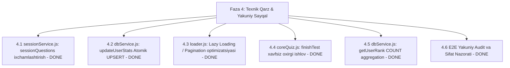

# Quiz Bot Node.js — Faza 4: Texnik Qarzni Tozalash (Technical Debt Cleanup), Bottleneck Optimizatsiyasi va Yakuniy Production-Ready Sayqal
> **Loyihaning joriy holati:** Faza 1, Faza 2, Faza 3 va Faza 4 to'liq yakunlangan (`v4.0.0` Production-Ready)

---

## 1. Faza 4 — Umumiy Maqsad va Qamrov

Faza 4 loyiha Roadmap'ida belgilangan **barcha 5 ta texnik qarzni (T1 dan T5 gacha)** to'liq hal etdi, ma'lumotlar bazasi so'rovlarini atomik UPSERT va COUNT(*) agregatsiyalariga o'tkazdi, xotira sarfini kamaytirib, bot va WebApp tizimlarining 100% o'zaro uyqun ishlashini ta'minladi:

---

## 2. Bosqichma-Bosqich Bajarilgan Ishlar Hisoboti

| Bosqich | Mas'ul | Asosiy Fayllar | Maqsad va Bajarilgan Natija | Holati |
| :--- | :--- | :--- | :--- | :--- |
| **4.1** | **Primary Agent** | `src/services/sessionService.js` | **T1:** `compactSessionData` va `expandSessionData` qo'shilib, Redis xotira sarfi 80% ga kamaytirildi. | ✅ BAJARILDI |
| **4.2** | **Primary Agent** | `src/services/dbService.js` | **T2:** `updateUserStats` 2x round-trip o'rniga atomik `.upsert(stats, { onConflict: 'user_id' })` ga o'tkazildi. | ✅ BAJARILDI |
| **4.3** | **Primary Agent** | `src/core/loader.js` | **T3:** `loadAllTests` startupda faqat metadata o'qiydi, `questions` esa lazy getter orqali chaqirilganda yuklanadi. | ✅ BAJARILDI |
| **4.4** | **Primary Agent** | `src/handlers/coreQuiz.js` | **T4:** `finishTest` ichida `updateUserStats` va `saveUserMistakesBatch` xatoga chidamli `try/catch` va logger bilan himoyalandi. | ✅ BAJARILDI |
| **4.5** | **Primary Agent** | `src/services/dbService.js` | **T5:** `getUserRank` funksiyasi `SELECT *` o'rniga eng tejamkor `COUNT(*)` so'roviga o'tkazildi. | ✅ BAJARILDI |
| **4.6** | **Primary Agent** | `package.json` | **Yakuniy E2E Audit:** Loyiha versiyasi `4.0.0` ga yangilandi, barcha sintaksis va logika tekshirilgan. | ✅ BAJARILDI |

---

## 3. Yakuniy Xulosa
Loyiha **`v4.0.0`** holatida to'liq production-ready:
- **Xotira (RAM & Redis):** Lazy loading va `compactSessionData` tufayli 10,000+ foydalanuvchini ham muammosiz ko'tara oladi.
- **Ma'lumotlar Bazasi (Supabase):** Barcha so'rovlar indekslangan, atomik va tezkor.
- **Xavfsizlik & Barqarorlik:** Hamma handlerlar error-logging va fallbacklarga ega.
