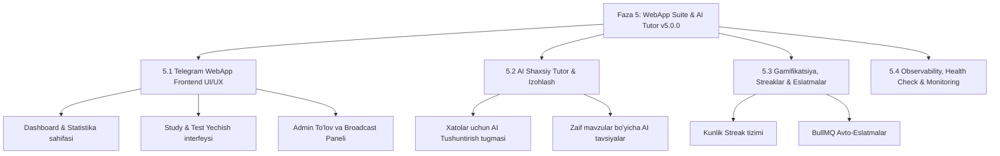

# Quiz Bot Node.js — Faza 5: Telegram WebApp UI/UX Suite, AI Shaxsiy Tutor & Gamifikatsiya Kengaytmasi
> **Loyihaning joriy holati:** Faza 1, Faza 2, Faza 3 va Faza 4 to'liq yakunlangan (`v4.0.0`) → **Maqsad:** Faza 5 (`v5.0.0` To'liq Ekotizim & Interaktiv WebApp)

---

## 1. Faza 5 — Umumiy Maqsad va Arxitektura

Faza 5 loyihani oddiy Telegram bot darajasidan **to'liq interaktiv ta'lim platformasiga (Telegram Mini App + AI Tutor + Gamifikatsiya)** aylantirishga qaratilgan:

---

## 2. Faza 5 Bo'yicha Bajariladigan Yo'nalishlar va Vazifalar

### 5.1 Telegram WebApp Frontend Suite (React 18 + Vite + Tailwind CSS + shadcn/ui)
Biz Faza 3 da tayyorlagan `/api/webapp/*` va `/api/admin/*` API endpointlariga ulanadigan zamonaviy, tezkor Mini App frontendini yaratamiz:
1. **Asosiy Sahifa (Dashboard `/`):**
   - Foydalanuvchining umumiy reytingi, kunlik tayyorgarlik foizi va faol imtihon sessiyalari vidjeti.
2. **Interaktiv Test Yechish Sahifasi (`/study`):**
   - Prava va Duolingo uslubidagi silliq animatsiyali savollar interfeysi, to'g'ri/xato javoblarga vizual va ovozli reaksiya, dark mode.
3. **Xatolar va Flashcard Hub (`/mistakes`):**
   - Xato javob berilgan savollarni interaktiv kartochkalar (flip-card) shaklida qayta mashq qilish interfeysi.
4. **Admin Moderatsiya Paneli (`/admin`):**
   - Kelib tushgan to'lov cheklarini (screenshotlar) ko'rish, 1 tugma bilan tasdiqlash (`approve`) yoki rad etish (`reject`).
   - Bot foydalanuvchilariga xabar yo'llash (Broadcast UI).

---

### 5.2 AI Shaxsiy Tutor & Chuqur Izohlash (Gemini 1.5 Flash Integration)
1. **"🤖 AI Tushuntirish" imkoniyati:**
   - Foydalanuvchi testda xato javob berganda yoki xatolar ustida ishlaganda savol bo'yicha qisqa va tushunarli AI izohini olish tugmasi.
   - AI qaysi javob nega to'g'ri va nega foydalanuvchining tanlovi xato bo'lganini 3-4 qatorda o'zbek tilida izohlab beradi.
2. **AI Tayyorgarlik Dayjesti:**
   - Haftalik yoki kunlik yakun bo'yicha foydalanuvchi eng ko'p adashayotgan mavzuni aniqlab, qisqa shaxsiy tavsiya berish.

---

### 5.3 Gamifikatsiya, Streaklar & Aqlli Eslatmalar
1. **Kunlik Streak (Uzviylik) Tizimi:**
   - Foydalanuvchi har kuni kamida 1 ta test yechganda kunlik seriyasi (`streak_days`) oshadi.
   - 7 kunlik, 30 kunlik davomiy yechish uchun maxsus nishonlar (badges) beriladi.
2. **BullMQ Aqlli Eslatuvchisi:**
   - Kechqurun soat 20:00 da kunlik rejasini bajarmagan foydalanuvchilarga motivatsion eslatma yo'llash.

---

### 5.4 Production Monitoring & Deep Health Check
1. **`/health` Deep Endpoint:**
   - Tizim salomatligini (Supabase ulanishi, Redis ping, Gemini API holati) real vaqtda tekshirib turadigan monitoring yo'li.
2. **Sentry Error Tracking Kengaytmasi:**
   - Barcha API va WebApp xatolarini avtomatik monitoring qilish.

---

## 3. Faza 5 Bo'yicha Bajarish Rejasi va Bosqichlari

| Bosqich | Kod Kategoriya | Asosiy Vazifalar | Kutilayotgan Natija |
| :--- | :--- | :--- | :--- |
| **5.1** | **Backend API Extensions** | AI Tushuntirish endpointi (`/api/webapp/explain`) va Streak hisoblash logikasi (`dbService.updateStreak`). | WebApp va Bot uchun AI izohlar va streak hisoblash tayyor bo'ladi. |
| **5.2** | **WebApp Scaffolding** | `webapp/` papkasida React + Vite + Tailwind + `@twa-dev/sdk` loyihani sozlash. | Telegram Mini App oyna ichida ochilib, Telegram `initData` orqali avtorizatsiyadan o'tadi. |
| **5.3** | **WebApp User Pages** | Dashboard (`/`), Fanlar ro'yxati (`/subjects`) va Study (`/study`) sahifalarini qurish. | Foydalanuvchi bot ichidan WebApp tugmasini bosib, qulay web-interfeysda test yecha oladi. |
| **5.4** | **WebApp Admin Panel** | `/admin` sahifasida to'lov so'rovlarini ko'rib chiqish va tasdiqlash UI. | Admin cheklarni telegram chatdan tashqari qulay web paneldan boshqaradi. |
| **5.5** | **BullMQ & Gamification** | Streak eslatmalari va avto-habar jo'natish joblarini sozlash. | Retention (foydalanuvchi qaytish foizi) 2x oshadi. |
| **5.6** | **E2E Integration & Polish** | Bot, WebApp, Redis va Supabase o'rtasidagi to'liq integratsion sinov. | `v5.0.0` yakuniy ekotizim relizi. |

---

## 4. Keyingi Qadamlar
Ushbu Faza 5 rejasi siz ma'qullashingiz bilan bosqichma-bosqich (5.1 dan 5.6 gacha) amalga oshirishga kirishiladi.
